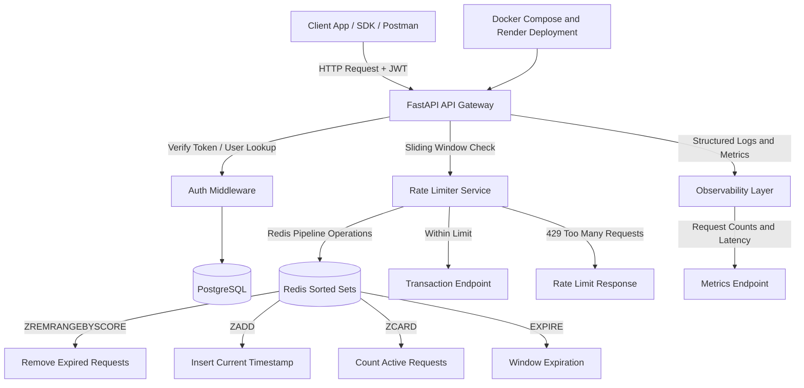

# Transaction Rate Limiter API

## What This Is
A FastAPI backend implementing Redis-backed sliding window rate limiting with JWT authentication and request-level observability. It uses a **sliding window algorithm** backed by Redis to restrict the number of transactions a user can perform within a given timeframe. If a user exceeds their quota, they receive a `429 Too Many Requests` response.

## Demo
- Live: https://rate-limiter-tb19.onrender.com/
- Walkthrough (2 min):

## Architecture


## Design Decisions
- **Sliding Window vs Token Bucket**: Chosen sliding window using Redis `ZSET` to allow for highly accurate, millisecond-level precision of request throttling to provide smoother request throttling than fixed-window counters.
- **Redis Pipelines**: Used Redis pipelines for the rate limiting operations (ZREMRANGEBYSCORE, ZADD, ZCARD, EXPIRE) to batch commands and minimize network roundtrips, to reduce network roundtrips and improve request throughput.
- **Dependency Injection**: Used FastAPI's `Depends` for extracting the JWT token and current user ID, making the code modular and easily testable.

## Load Test Results

Local load test with [k6](https://k6.io/): **100 VUs** for **1 minute** against `POST /transactions` (limit: 5 req / 60s per user).

| Metric | Value |
| --- | --- |
| Requests/sec | 814.9 |
| Latency p50 / p95 / p99 | 114.6 ms / 173.7 ms / 216.5 ms |
| % rate-limited (HTTP 429) | 99.99% (48,973 / 48,978) |

<details>
<summary>Raw k6 output</summary>

```
     scenarios: (100.00%) 1 scenario, 100 max VUs, 1m30s max duration (incl. graceful stop):
              * default: 100 looping VUs for 1m0s (gracefulStop: 30s)

  █ TOTAL RESULTS

    checks_total.......: 48978   814.886466/s
    checks_succeeded...: 100.00% 48978 out of 48978
    checks_failed......: 0.00%   0 out of 48978

    ✓ 200 or 429

    CUSTOM
    rate_limited_responses.........: 48973  814.803277/s
    successful_responses...........: 5      0.083189/s

    HTTP
    http_req_duration..............: med=114.61ms p(95)=173.74ms p(99)=216.52ms
    http_req_failed................: 99.98% 48973 out of 48978
    http_reqs......................: 48978  814.886466/s

    EXECUTION
    iteration_duration.............: med=114.67ms p(95)=173.83ms p(99)=216.64ms
    iterations.....................: 48978  814.886466/s
    vus............................: 100    min=100            max=100
    vus_max........................: 100    min=100            max=100

running (1m00.1s), 000/100 VUs, 48978 complete and 0 interrupted iterations
default ✓ [ 100% ] 100 VUs  1m0s
```

</details>

### How to reproduce

`brew` is optional. With Docker installed (no Homebrew needed):

```bash
# 1. Start Postgres + Redis and the API (see How To Run below)
docker compose up -d
source venv/bin/activate
uvicorn app.main:app --host 127.0.0.1 --port 8000

# 2. Register / login and export a JWT
curl -s -X POST http://127.0.0.1:8000/auth/register \
  -H 'Content-Type: application/json' \
  -d '{"email":"loadtest@example.com","password":"loadtest123"}'
export TOKEN=$(curl -s -X POST http://127.0.0.1:8000/auth/login \
  -H 'Content-Type: application/json' \
  -d '{"email":"loadtest@example.com","password":"loadtest123"}' | python3 -c "import sys,json; print(json.load(sys.stdin)['access_token'])")

# 3. Run k6 (100 VUs, 1 minute). Use host.docker.internal on macOS/Windows.
docker run --rm \
  -e K6_SUMMARY_TREND_STATS="med,p(95),p(99)" \
  -e TOKEN="$TOKEN" \
  -e BASE_URL=http://host.docker.internal:8000 \
  -v "$(pwd)/scripts:/scripts" \
  grafana/k6 run /scripts/k6-transactions.js
```

Script: `scripts/k6-transactions.js`. Each request sends a unique `Idempotency-Key` so idempotency caching does not skew rate-limit counts. Point `BASE_URL` at your deployed host (e.g. `https://rate-limiter-tb19.onrender.com`) to load-test production.

## How To Run
### Prerequisites
- Docker & Docker Compose
- Python 3.10+

### Setup
1. Clone the repository.
2. Create a virtual environment and install dependencies:
   ```bash
   python3 -m venv venv
   source venv/bin/activate
   pip install -r requirements.txt
   ```
3. Start the infrastructure (PostgreSQL & Redis):
   ```bash
   docker compose up -d
   ```
4. Run the application:
   ```bash
   uvicorn app.main:app --reload
   ```

## Endpoints
- `POST /auth/register`: Register a new user.
- `POST /auth/login`: Authenticate and receive a JWT.
- `GET /protected`: Test JWT authentication.
- `POST /transactions`: Mock transaction endpoint (Rate Limited to 5 requests / 60 seconds).
- `GET /ratelimit/status`: Check remaining quota without triggering a limit increment.
- `GET /metrics`: Health and application metrics.
