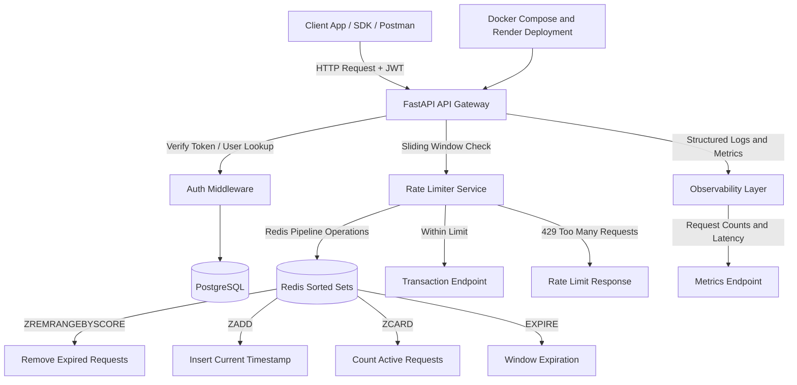

# Transaction Rate Limiter API

## What This Is
A FastAPI backend implementing Redis-backed sliding window rate limiting with JWT authentication and request-level observability. It uses a **sliding window algorithm** backed by Redis to restrict the number of transactions a user can perform within a given timeframe. If a user exceeds their quota, they receive a `429 Too Many Requests` response.

## Architecture


## Design Decisions
- **Sliding Window vs Token Bucket**: Chosen sliding window using Redis `ZSET` to allow for highly accurate, millisecond-level precision of request throttling to provide smoother request throttling than fixed-window counters.
- **Redis Pipelines**: Used Redis pipelines for the rate limiting operations (ZREMRANGEBYSCORE, ZADD, ZCARD, EXPIRE) to batch commands and minimize network roundtrips, to reduce network roundtrips and improve request throughput.
- **Dependency Injection**: Used FastAPI's `Depends` for extracting the JWT token and current user ID, making the code modular and easily testable.

## Load Test Results
*(To be populated after deployment load tests)*

## How To Run
### Prerequisites
- Docker & Docker Compose
- Python 3.10+

### Setup
1. Clone the repository.
2. Create a virtual environment and install dependencies:
   ```bash
   python3 -m venv venv
   source venv/bin/activate
   pip install -r requirements.txt
   ```
3. Start the infrastructure (PostgreSQL & Redis):
   ```bash
   docker compose up -d
   ```
4. Run the application:
   ```bash
   uvicorn app.main:app --reload
   ```

## Endpoints
- `POST /auth/register`: Register a new user.
- `POST /auth/login`: Authenticate and receive a JWT.
- `GET /protected`: Test JWT authentication.
- `POST /transactions`: Mock transaction endpoint (Rate Limited to 5 requests / 60 seconds).
- `GET /ratelimit/status`: Check remaining quota without triggering a limit increment.
- `GET /metrics`: Health and application metrics.
