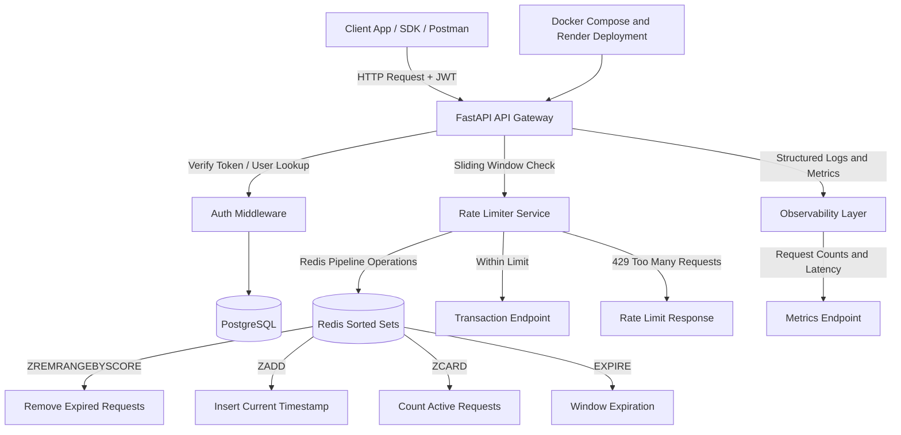

# Transaction Rate Limiter API

## What This Is
A FastAPI backend implementing Redis-backed sliding window rate limiting with JWT authentication and request-level observability. It uses a **sliding window algorithm** backed by Redis to restrict the number of transactions a user can perform within a given timeframe. If a user exceeds their quota, they receive a `429 Too Many Requests` response.

## Demo
- Live: https://rate-limiter-tb19.onrender.com/
- Walkthrough (3.5 mins): https://www.loom.com/share/caeacdba84ad477cbdf3aaa1b1a49b06

<p align="center">
    <a href="[https://www.loom.com/share/8916ae03dfa345b683c4e235d31c3eea](https://www.loom.com/share/caeacdba84ad477cbdf3aaa1b1a49b06)">
    
    </a>
</p>

## Architecture


## Design Decisions
- **Sliding Window vs Token Bucket**: Chosen sliding window using Redis `ZSET` to allow for highly accurate, millisecond-level precision of request throttling to provide smoother request throttling than fixed-window counters.
- **Redis Pipelines**: Used Redis pipelines for the rate limiting operations (ZREMRANGEBYSCORE, ZADD, ZCARD, EXPIRE) to batch commands and minimize network roundtrips, to reduce network roundtrips and improve request throughput.
- **Dependency Injection**: Used FastAPI's `Depends` for extracting the JWT token and current user ID, making the code modular and easily testable.

## Load Test Results

Concurrency validation with [k6](https://k6.io/) using 100 VUs for 1 minute against `POST /transactions` (`5 req / 60s` limit).

| Metric | Value |
| --- | --- |
| Requests/sec | 814.9 |
| Latency p50 / p95 / p99 | 114.6 ms / 173.7 ms / 216.5 ms |
| Rate-Limited Responses (HTTP 429) | 99.99% (48,973 / 48,978) |

- Sliding-window enforcement remained consistent under concurrent burst traffic.
- Redis `ZSET` operations (`ZREMRANGEBYSCORE`, `ZADD`, `ZCARD`, `EXPIRE`) were pipelined to reduce roundtrips.
- No inconsistent request counts or duplicate successful requests were observed during the test.

<details>
<summary>Raw k6 output</summary>

```text
http_reqs.............: 48978  814.88/s
http_req_duration.....: p(50)=114.61ms p(95)=173.74ms p(99)=216.52ms
successful_responses..: 5
rate_limited_responses: 48973
```

</details>

### Reproduce

```bash
docker run --rm \
  -e TOKEN="$TOKEN" \
  -e BASE_URL=http://host.docker.internal:8000 \
  -v "$(pwd)/scripts:/scripts" \
  grafana/k6 run /scripts/k6-transactions.js
```

## How To Run
### Prerequisites
- Docker & Docker Compose
- Python 3.10+

### Setup
1. Clone the repository.
2. Create a virtual environment and install dependencies:
   ```bash
   python3 -m venv venv
   source venv/bin/activate
   pip install -r requirements.txt
   ```
3. Start the infrastructure (PostgreSQL & Redis):
   ```bash
   docker compose up -d
   ```
4. Run the application:
   ```bash
   uvicorn app.main:app --reload
   ```

## Endpoints
- `POST /auth/register`: Register a new user.
- `POST /auth/login`: Authenticate and receive a JWT.
- `GET /protected`: Test JWT authentication.
- `POST /transactions`: Mock transaction endpoint (Rate Limited to 5 requests / 60 seconds).
- `GET /ratelimit/status`: Check remaining quota without triggering a limit increment.
- `GET /metrics`: Health and application metrics.
